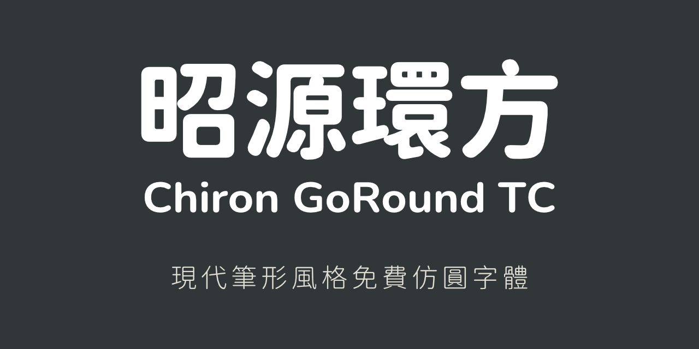

昭源環方 Chiron GoRound TC (預覽版)
=======================

## 簡介

昭源環方 (Chiron GoRound TC) 是一款以昭源黑體為基礎製作的開源、免費仿圓設計字體。

[昭源黑體](https://github.com/chiron-fonts/chiron-hei-hk/)是由[思源黑體香港版 (Source Han Sans - Traditional Chinese, Hong Kong)](https://github.com/adobe-fonts/source-han-sans)
修改而成，提供一套**平衡標準字形和印刷體慣用筆形**的**現代筆形風格**開源黑體字型產品。昭源環方則是利用電腦程式，將昭源黑體筆畫圓角化，創造出一套相同筆形風格的仿圓體字型。

本字體名為「昭源環方」，意指將方體（黑體又名方體）字進行圓形化處理。

## 動機及特色

現時在開源字體世界中有好幾款自思源黑體修改而來的圓體字型，不過都是提供傳統印刷體（舊字形）的字樣，又或是由思源字體地區版本改造。昭源環方則是以昭源黑體為基礎，採用現代筆形風格，考慮字體骨架，平衡地區標準字形和印刷體慣用字形，以滿足喜歡這一風格字形的設計師和用戶。

昭源環方的特色如下：

1. 經調整的現代筆形風格，相對親切、美觀。
2. 西文字體嵌入 [Nunito](https://fonts.google.com/specimen/Nunito) 字體，非單純機械圓角化。
3. 提供 10 種字重，從 ExtraLight 到 Heavy，並有可變字重版本。
4. 除了桌面版本之外，更提供已作 Unicode-range subsetting 處理的 WOFF2 格式網頁字型，方便在網頁使用。
5. 採用 SIL Open Font License 1.1 授權，開源、免費。

## 下載

使用者可前往 [Releases](https://github.com/chiron-fonts/chiron-go-round-tc/releases) 頁下載本字體。

## 格式

昭源環方提供以下字型格式：

1. OTF (OpenType) 靜態字重版本（`OTF/` 目錄）
2. TTF (TrueType) 靜態字重版本（`TTF/` 目錄）
3. OTF 可變字體版本（`VAR/` 目錄，`.otf` 副檔名）
4. TTF 可變字體版本（`VAR/` 目錄，`.ttf` 副檔名）
5. WOFF2 網頁字型（`WOFF2_OTF/` 和 `WOFF2_TTF/` 目錄）

使用者可以根據需要安裝相應的字型檔案。靜態字重版本安裝後的名稱為 `Chiron GoRound TC`，可變字體則為 `Chiron GoRound TC VF`。

至於網頁字型指定的 `font-family` 名稱為 `Chiron GoRound TC WS`
。有關網頁字型檔案的使用及其他託管方式，請參考[昭源字體網站網頁字型頁](https://chiron-fonts.github.io/usage/webfont/)。

## 字重

昭源環方提供以下 10 種字重：

| 字重值 | 字重代號（縮寫） | 字重代號（長寫）   | 
|-----|----------|------------|
| 200 | EL       | ExtraLight |
| 300 | L        | Light      |
| 350 | N        | Normal     |
| 400 | R        | Regular    |
| 450 | BK       | Book       |
| 500 | M        | Medium     |
| 600 | SB       | SemiBold   |
| 700 | B        | Bold       |
| 800 | EB       | ExtraBold  | 
| 900 | H        | Heavy      |

字重在靜態字重版本會使用縮寫（例如 `Chiron GoRound TC EL`），可變字體則會使用長寫（例如 `Chiron GoRound TC VF ExtraLight`）。

## 使用須知

- 圓角化是使用電腦程式自動處理，未必每個字形的轉換結果都盡如人意，敬請諒解。
- 字體圓角化主要針對繁體中文字形，其他如假名、諺文、英文只作基本圓角處理，也不支援簡化字。

## 網站

有關昭源字體的其他資料可參閲網站：[https://chiron-fonts.github.io/](https://chiron-fonts.github.io/)

## 其他昭源字體

- [昭源黑體](https://github.com/chiron-fonts/chiron-hei-hk)
- [昭源宋體](https://github.com/chiron-fonts/chiron-sung-hk)

## 授權

昭源環方採用 SIL Open Font License, 版本 1.1 授權。詳情請參閲 [LICENSE.md](LICENSE.md) 檔（只提供英文版本）。

## 贊助

昭源字體屬個人開發的字型產品，完全免費。假如滿意我在昭源字體所做的工作，而想表達心意或支持，[歡迎通過 Paypal.me 捐助本人](https://www.paypal.com/paypalme/tamcyhk)
，金額不拘，先此致謝。
